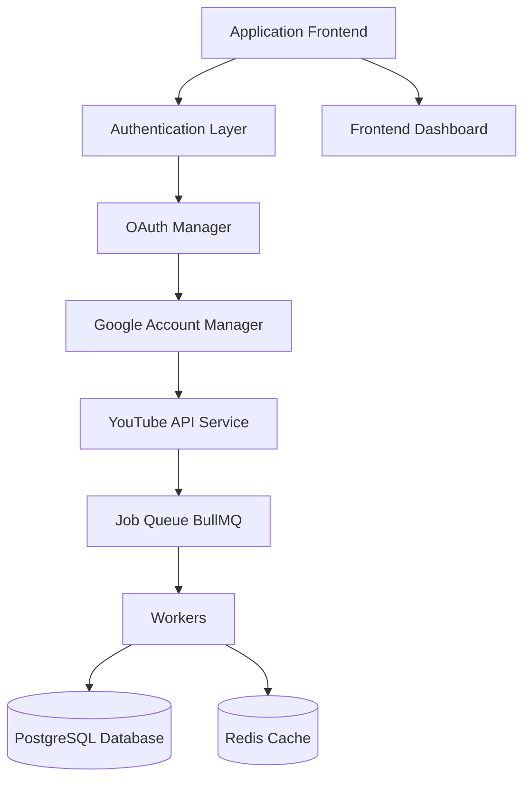

# YouTube Multi-Account & Multi-Channel Management Platform

A production-grade SaaS web application designed for centralized management of multiple Google accounts and all associated YouTube channels. The platform automatically discovers YouTube channels owned or managed by those accounts and enables users to manage them from a single, unified dashboard.

---

## 📋 Summary & Core Concept

Build a production-grade SaaS web application that allows a user to:
- Connect multiple, unlimited Google accounts.
- Automatically discover every YouTube channel (owned or managed) associated with those accounts.
- Manage and perform actions across all channels from a single centralized dashboard.
- Scale seamlessly to enterprise levels with independent, loosely coupled modules.

---

## 🛠️ Technical Stack

The application leverages a modern, robust, and scalable stack:

*   **Frontend**:
    *   **Framework**: Next.js (App Router)
    *   **Language**: TypeScript
    *   **Library**: React
    *   **Styling**: TailwindCSS, shadcn/ui
    *   **State Management**: Zustand, React Query / TanStack Query
*   **Backend & Orchestration**:
    *   **Runtime**: Node.js
    *   **Framework**: Express
    *   **Database**: PostgreSQL
    *   **ORM**: Prisma ORM
    *   **Caching & Queueing**: Redis, BullMQ
*   **DevOps & Security**:
    *   **OAuth**: Google OAuth 2.0
    *   **Containers**: Docker, Docker Compose
    *   **Web Server / Reverse Proxy**: Nginx
    *   **Monitoring**: Prometheus, Grafana, Sentry
    *   **Logging**: Winston / Pino
    *   **Hosting**: VPS / AWS / Azure

---

## 🎯 Primary Objectives

1.  **Account Management**: Create an account in the application and connect unlimited Google Accounts through OAuth.
2.  **Automated Discovery**: Automatically detect all YouTube channels under each connected account.
3.  **Centralized Control**: Store and organize all channels in one dashboard.
4.  **Advanced Search & Filter**: Search channels by Channel Name, `@Username`, Channel ID, Google Account, Tags, and Favorites.
5.  **Multi-Selection Support**: Select one, multiple, or all channels to execute operations.
6.  **Identity Mapping**: Perform supported YouTube operations using the correct authenticated identity for each selected channel.
7.  **Auto-Token Refresh**: Automatically refresh expired OAuth tokens.
8.  **Audit Logs & History**: Display operation history and maintain comprehensive logs.
9.  **Scalability**: Scale the architecture to enterprise level.

---

## 🏗️ High-Level Architecture

The components must be independent and loosely coupled:

---

## 📦 Modules Overview

### Module 1: Authentication System
*   **Features**: Application Login, Registration, JWT Authentication, Session Management, Refresh Tokens, Password Reset, Email Verification.
*   **Data Models**: Users, Sessions, Refresh Tokens, Roles, Permissions.

### Module 2: Google Account Manager
*   **Features**: Manage unlimited Google accounts.
*   **Stored Attributes**: Google ID, Email, Profile Picture, Access Token, Refresh Token, Expiry Time, Scopes, Connected Date, Status.
*   **Operations**: Add Account, Reconnect, Disconnect, Refresh Tokens, Sync, Delete.

### Module 3: Channel Discovery
*   **Features**: Auto-fetch and store Channel ID, Title, Handle, Description, Thumbnail, Subscriber Count, Video Count, Country, Language, Google Account ID, Brand Account Flag, and Last Synced timestamp.

### Module 4: Channel Dashboard
*   **Features**: Cards-based layout, Search, Sort, Filter, Pagination, Grid/Table view toggles, Favorites, Tags, and Bulk Selection.

### Module 5: Channel Groups
*   **Features**: Creation of custom channel groups and target group-specific operations.

### Module 6: Search Engine
*   **Features**: Fuzzy global search by Channel Name, `@Handle`, Google Email, Channel ID, Tags, Group, Subscribers, Country, and Status.

### Module 7: Operation Engine
*   **Features**: Background-job lifecycle, job metadata management, and job execution logs.

### Module 8: Queue System
*   **Features**: BullMQ-based queue organization.
*   **Queues**: Sync, Operation, Notification, Analytics, Maintenance.
*   **Policies**: Retries, priority, concurrency controls, delayed/scheduled jobs, and dead letter queue.

### Module 9: Worker Architecture
*   **Features**: Stateless workers processing background jobs, dynamic OAuth loading/refreshing, operation execution, database result storage, and progress publishing.

### Module 10: OAuth Manager
*   **Features**: Token expiration detection, automatic token refresh, request retries, reconnection handling if refresh token expires, and refresh logging.

### Module 11: Activity History
*   **Features**: Complete audit logs containing User, Google Account, Channel, Operation, Timestamp, Status, Execution Time, and Errors.

### Module 12: Notifications
*   **Features**: In-app, email, or webhook notifications triggered by OAuth issues, account actions, sync status, operation updates, or worker events.

### Module 13: Analytics Dashboard
*   **Features**: Visualizations for connected accounts/channels, operation rates, failures, retries, API response times, OAuth expirations, and queue/worker health.

### Module 14: User Settings
*   **Features**: Theme selection, Timezone, Notification Preferences, Default View/Sorting/Filters, Language, and API Limits.

### Module 15: Security
*   **Features**: Encrypted OAuth tokens, secure secrets management, CSRF protection, rate limiting, security headers (Helmet), CORS policies, JWT/request validation, audit logs, and Role-Based Access Control (RBAC).

### Module 16: Database Design
*   **Tables**: `Users`, `GoogleAccounts`, `OAuthTokens`, `Channels`, `Groups`, `GroupMembers`, `Jobs`, `JobResults`, `Notifications`, `AuditLogs`, `Sessions`, `Settings`.

### Module 17: Folder Structure
*   **Layout**:
    *   `apps/`
        *   `dashboard/`
        *   `api/`
    *   `packages/`
        *   `auth/` | `database/` | `youtube/` | `queue/` | `ui/` | `workers/` | `sync/` | `operations/` | `analytics/` | `notifications/` | `shared/` | `types/` | `utils/` | `config/`

### Module 18: API Structure
*   **Endpoints**: Authentication, Account Management, Channel Management, Search, Operations, Jobs, Notifications, Analytics, Settings, Health Checks.

### Module 19: UI Pages
*   **Views**: Login, Register, Dashboard, Google Accounts, Channels, Groups, Jobs, Activity, Notifications, Analytics, Settings, Profile, Help.

### Module 20: Future Roadmap
*   **Extensions**: Team Collaboration, Organization Accounts, Multiple Users, Role Management, Developer API Keys, Public REST API, GraphQL API, Webhook Support, Plugin System, Browser Extension, Desktop Application, Mobile Application, AI Assistant, Natural Language Search, Smart Analytics, Recommendation Engine, Cloud Sync, Offline Support, Enterprise Administration.

---

## ⚡ Scalability Goals & Standards

*   **Targets**: Support 1,000+ Google accounts, 10,000+ YouTube channels, and millions of database records.
*   **Infrastructure**: Horizontal worker scaling, multiple application servers, Redis clustering, PostgreSQL replication, and containerized deployment with Docker & Kubernetes.
*   **Best Practices**: Follow Clean Architecture, dependency injection where appropriate, strict TypeScript typing, comprehensive logging/error handling, and modular extensibility.
